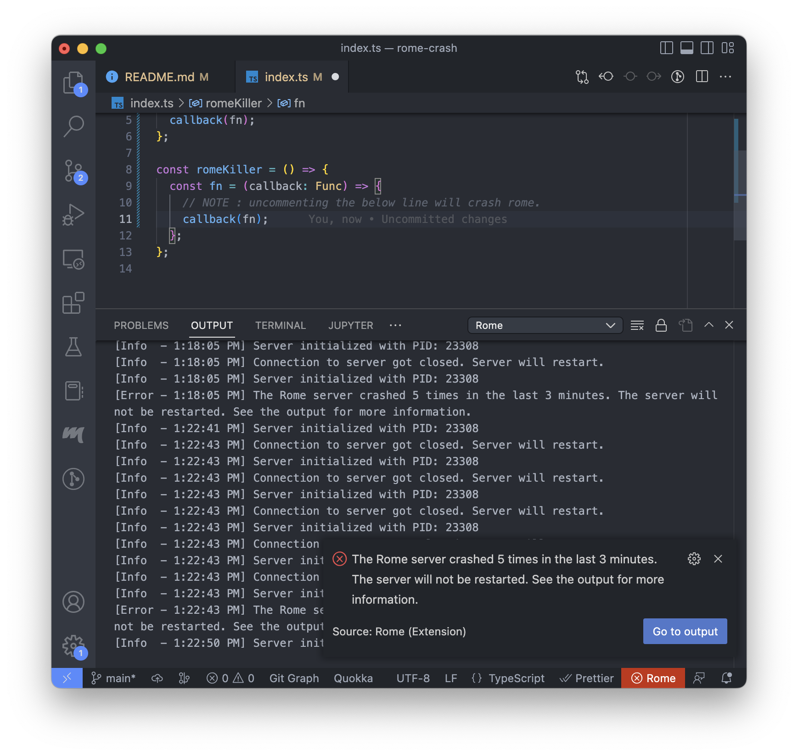

# Rome crash report

## Environment

- Device : MacBook Air (M1, 2020)
    - OS : macOS Monterey 12.4
    - Memory : 8GB

- Visual Studio Code
    ```
    Version: 1.72.2 (Universal)
    Commit: d045a5eda657f4d7b676dedbfa7aab8207f8a075
    Date: 2022-10-12T22:16:30.254Z (1 mo ago)
    Electron: 19.0.17
    Chromium: 102.0.5005.167
    Node.js: 16.14.2
    V8: 10.2.154.15-electron.0
    OS: Darwin arm64 21.5.0
    Sandboxed: No
    ```

- Rome VSCode Extension
    - Identifier: "rome.rome"
    - Version: v0.18.1 (Preview)

## How to reproduce

0. Prepare VSCode and Rome extension.

1. Open VSCode with this repository.

2. Open `index.ts`.

3. Get around with code to see if Rome extension is alive and working.

4. Uncomment the line 11.
```
// callback(fn);
```

5. After a while, VSCode shows crash message for Rome.


